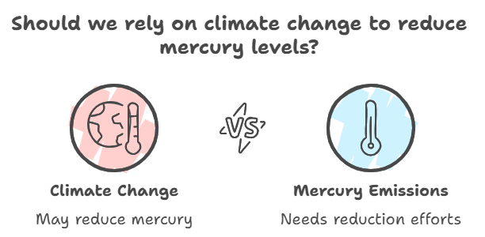
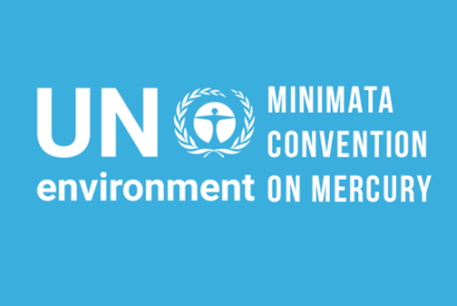
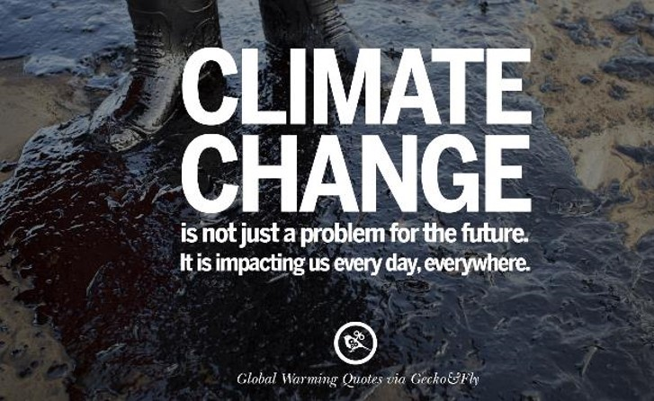

---

title: "How will future climate change impact marine mercury cycling?"
summary: Our study shows that, contrary to concerns, global climate change may reduce seawater methylmercury levels in a worst-case scenario, potentially buying time to mitigate human health risks through efforts to reduce mercury emissions.
authors: [admin, Yanxu Zhang]
tags: ["Mercury","Climate Change",  "Biogeochemistry"]
date: 2021-09-03

# Optional external URL for project (replaces project detail page).
external_link: ""

# Featured image
# To use, add an image named `featured.jpg/png` to your page's folder.
# Focal points: Smart, Center, TopLeft, Top, TopRight, Left, Right, BottomLeft, Bottom, BottomRight.
image:
  caption: ""
  focal_point: "TopLeft"
  preview_only: true
  placement: 2

# Custom links (optional).
#   Uncomment and edit lines below to show custom links.
# links:
# - name: Follow
#   url: https://twitter.com
#   icon_pack: fab
#   icon: twitter

url_code: ""
url_pdf: ""
url_slides: ""
url_video: "PNAS-Hg-summary.mp4"

---

Mercury (Hg) is a persistent global pollutant, and its transformation in the ocean plays a critical role in its biogeochemical cycle. Methylmercury (CH3Hg), a potent neurotoxin formed by marine microbes, accumulates through the marine food web, ultimately affecting human health through seafood consumption. Climate change, driven by human activities, has caused significant alterations in ocean conditions—such as rising temperatures, acidification, and biodiversity loss—that influence mercury cycling and its uptake by marine organisms.

One concern raised by climate-induced changes in the oceans is the potential increase of neurotoxic methylmercury in seafood. In our study, we examined how global climate change, under a business-as-usual emission scenario, affects the global ocean mercury cycle by integrating data from 3D marine biogeochemical, ecosystem, and Earth system models. We identified several key pathways through which climate change alters marine mercury dynamics. These include reduced air-sea exchange due to weaker winds, decreased particulate organic carbon export affecting mercury deposition, and increased photodemethylation of methylmercury due to higher shortwave radiation. Collectively, these changes suggest a complex interaction between physical, chemical, and biological factors that influence mercury levels in the oceans. 

*This following video provides a brief illustration of the impact pathways identified in our research.*



Our research offers a broad perspective on this issue, highlighting the intricate interplay of factors, including climate dynamics and ocean ecology. Our findings reveal that while some aspects of climate change exacerbate mercury release, others, such as enhanced photodegradation of methylmercury, may reduce its concentration in seawater and marine life. This could buy us time to mitigate the release of mercury into the environment. Our results underscore the necessity of a holistic approach to studying the impact of climate change, considering both its potential benefits and detriments. This insight is valuable for guiding future policymaking, aligning it with multiple planetary boundaries, and fostering sustainable practices in a changing world.

