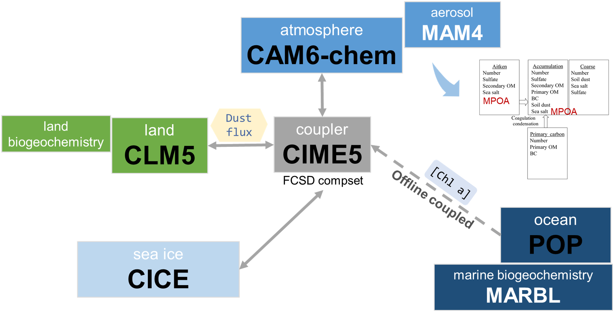

Aerosols play a crucial role in shaping Earth's climate, influencing radiative properties, weather patterns, and biogeochemical processes. Our research has advanced the representation of aerosols in the Community Earth System Model (CESM) by developing updated emission schemes for dust, sea-salt, and marine primary organic aerosols (MPOA). These updates improve dust aerosol optical depth simulations and shorten dust residence time, leading to more accurate concentration predictions in regions like North Africa and Central Asia. Additionally, our modifications to the sea-salt emission scheme, which account for sea surface temperature and humidity, further refine the accuracy of these emissions.

We also extended the model to incorporate MPOA emissions, highlighting the substantial impact of phytoplankton diversity on aerosol formation. By coupling these emissions with the ocean's physical and biological processes, we capture a more nuanced interaction between marine ecosystems and atmospheric aerosols. This approach demonstrates the critical role biological variability plays in shaping aerosol dynamics, emphasizing the importance of integrating oceanic data in atmospheric modeling.

In addition to emission updates, we improved CESM’s chemical processes by introducing a new pathway for secondary organic aerosol (SOA) formation. This new mechanism, which includes the irreversible uptake of dicarbonyl compounds, enhances the model’s ability to simulate natural aerosol formation and distribution. Overall, these enhancements to CESM provide a more comprehensive understanding of how natural aerosols are produced and how they interact with the Earth’s climate system, paving the way for better predictions of future climate scenarios.